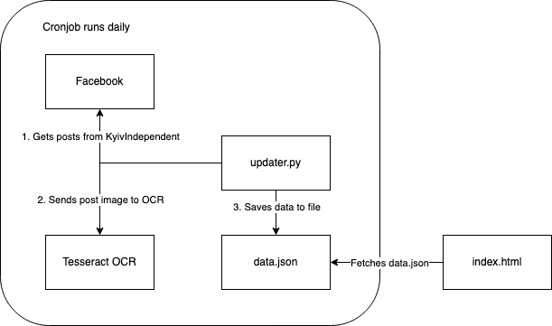

# [Russia's Losses](https://russiaslosses.netlify.app/)

Visualization of Russia's military losses throughout the war against Ukraine.

## How it works



Data is sourced from [KyivIndependent on Facebook](https://www.facebook.com/kyivindependent) daily images reporting the Russia's losses, like this https://fb.com/292598229942920. Data before 2023-04-21 was scraped from [@KyivIndependent's Twitter](https://twitter.com/KyivIndependent) until Twitter removed the free api access. `updater.py` parses the data by passing the image to Tesseract OCR.

The script assumes that images are uploaded daily, contain the word `Russia's losses` and stay consistent with the 2 columns format. OCR may produce incorrect reading of the image and manual corrections may be made.

The frontend is a simple html file which fetches data.json to generate [uPlot](https://github.com/leeoniya/uPlot/) charts.

## Getting Started

Basically follow the [Github Actions job](https://github.com/davidchoo12/russias-losses/blob/master/.github/workflows/update-data.yml)

```bash
sudo apt install -y tesseract-ocr libtesseract-dev
python3 -m venv .venv
pip install -r requirements.txt
python3 updater.py
python3 -m http.server
```

Open `localhost:8000/public/` and you should see the website.

## Inspiration

This is just a pet project inspired by the leadership of President Zelenskyy and the absolute resilience (and balls of steel!) of the Ukrainian people. I hope this goes to show how terrible the Russian army is.

I made this website in over 2 weeks of my free time where most of it is spent on perfecting the UI.

## License

[MIT](https://choosealicense.com/licenses/mit/)

## Acknowledgements

- [This reddit post](https://www.reddit.com/r/dataisbeautiful/comments/tomoul/oc_russiaukraine_war_2022_tank_losses_over_time/) for giving me the idea.
- [r/ukraine](https://www.reddit.com/r/ukraine/) where I found out about @KyivIndependent's daily report.
- [uPlot demos](https://leeoniya.github.io/uPlot/demos/index.html) for the many examples of how to customize it.
- [Grafana sandbox](https://play.grafana.org/) for UI inspirations.
